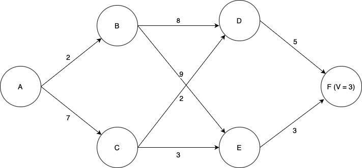
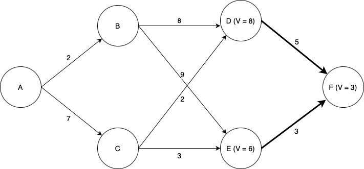
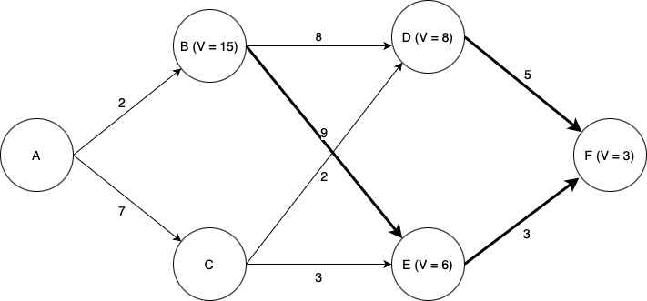
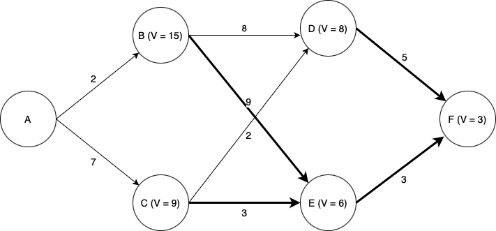
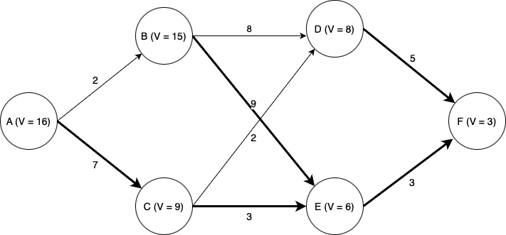

# Sequential Decision-Making

In the previous chapters (specifically, the CBF-CLF filters), we saw that a control input could be synthesized by adjusting the desired control as little as possible to satisfy the CBF and CLF constraints. But how was the desired control selected? And since we change the desired control for the *current* time, how does this effect the future behavior of the system? Would adjusting the desired control now affect the performance of the system in the future?

To answer these questions, we must consider a *sequence* of decisions (i.e., control inputs or actions) and reason about how each decision may have enduring consequences.


## Some motivating examples

**Going through college:** What are the consequences of (a) sleeping in and skipping lecture versus (b) waking up early and attending lecture? In option (a), the immediate reward is high/cost is low since you get to sleep in and relax, but in the future, you may be ill-prepared for the midterm and that requires you to spend *more* effort to revise for the midterm. So your future reward is low/cost is high. With option (b), your immediate reward is low/cost is high since you have to wake up early and spend effort paying attention in class, but you will be more prepared for the upcoming midterm and will not need to spend too much effort in revising for the midterm. So your future reward is high/cost is low.
So which option should you take? Well, that depends on the how much the immediate reward/cost compares with the future reward/cost.

We can extend this example, and consider the your decisions when taking a pre-requisite course (e.g., linear algebra) and how that may effect your performance in a future engineering course, which then may affect your competitiveness when applying for jobs or graduate programs, and so forth.

**Playing chess:** In the game of chess, your moves early in the game affect how your pieces are distributed across the board, and therefore will affect what moves you can make in the future, and ultimately, your ability to win the game. This is a rather challenging sequential decision-making problem because (i) there are many possible moves to make at any turn and many possible board configurations to consider, (ii) there is another player (the opponent) involved and they make moves that we have no control over, (iii) the game is (typically) a long one, involving many moves before a winner is determined, and the payoff of a move right now may not be immediate, but may not come until many moves later.

**Healthcare:** Suppose you want to treat a patient with a chronic condition. You can offer some treatment options which incur low risk, but which require some amount of effort or time/money cost for the patient, like regular exercise and monthly gym membership, regular therapy sessions that they need to drive to, or eating healthy food which costs more money to buy and time to make. Or, you could offer medium-risk treatment options such as taking a prescription drug that has some potential side effects, or you could offer high-risk surgery which is expensive, time-consuming, and has potential serious side effects. Then the question is: which treatment option should you offer over time as the patient's condition evolves over time?

These motivating examples involve the need to make a sequence of decisions where each decision will have a consequence---one that will be experienced immediately, and another which will be experienced in the future which will depend on the decision taken right now. Deciding which decision to make ultimately depends on how much you care about the consequences now versus the consequences in the future.
This is generally a very difficult choice to make for many reasons, but in particular, it is because (i) knowing exactly what the future consequences are is very challenging because there could be so many external influences that could affect it (i.e., stochasticity in the dynamics and disturbances), (ii) there could be many possible situations that arise and it is difficult to consider all the possible cases (i.e., large state space), and (iii) it is difficult to know the true cost/reward of a decision (e.g., how to do you measure the reward of sleeping in versus waking up on time to attend class?).

In the rest of the chapter, we will discuss a principled approach to solving these sequential decision-making problems, and how one may go about solving these problems.


## Principle of Optimality
The **Principle of Optimality** is a foundational concept in sequential decision-making and dynamic programming. There are many ways to describe it, here are some different versions of the same concept:

- An optimal solution to a problem contains within it optimal solutions to its subproblems.
- Given an optimal policy, any tail portion of that policy is also optimal for that sub-problem.
- If you're following an optimal control policy, then no matter what state you're in along the optimal trajectory, the remaining path must also follow the optimal policy from that state onward.

This principle suggests that if a problem is being solved optimally, then regardless of the decisions made in the past, the decisions that follow must also be optimal for the current state. This recursive nature enables us to decompose complex sequential decision-making problems into smaller, more manageable subproblems.
By leveraging the principle of optimality, we can systematically compute the best sequence of decisions by solving these subproblems, often using techniques like dynamic programming. By iteratively solving for the tail subproblems, we can then contruct the optimal policy---the optimal control to take from any state.

## Problem set-up: Optimal Control Problem
First, let us mathematically define the optimal control problem we seek to solve.
To start off, let us consider a *discrete time* and *finite-horizon* setting. The idea for continuous time is similar, but the resulting key equation we get at the end will be a partial differential equation instead of a difference equation.

Let $x_t, u_t$ denote the state and control at time step $t$. Suppose we seek to find an optimal sequence of controls that minimizes the total cost over a time horizon $T$.


```{math}
:label: eq-ocp
\min_{u_{0:T-1}} & \quad \sum_{t=0}^{T-1} J(x_t, u_t, t) + J_T(x_T)\\
\text{subject to} & \quad  x_{t+1} = f(x_t, u_t, t)\\
& \quad x_0 = x_\mathrm{current}\\
& \quad u_t \in \mathcal{U}(x_t, t), x_t \in\mathcal{X}_t\\
& \quad \text{Other constraints...}
```


What we have set up above is an *optimal control problem*. In addition to dynamics, initial state constraints, and control and state constraints, there could potentially be other constraints depending on the problem, like obstacle constraints, or something more complex like state-triggered constraints, or spatio-temporal constraints.

We have made an assumption here that the cost has an *additive* cost structure, where the total cost is sum of the cost for being at a state $x$ and executing a control $u$ at timestep $t$. This additive cost structure is important as this allows us to break down the problem into smaller subproblems. Also note that we have a *terminal cost* $J_T$ which denotes the cost of being at state $x_T$ at the end of the planning horizon.


## The Value Function (i.e., cost-to-go)

As the Principle of Optimality states, we can break down the search for an optimal policy into smaller tail subproblems. Given this, we define the concept of a *value function* $V_\pi(x,t)$, which is a function that describes the *future accumulated cost/reward* starting at state $x$ at time $t$ and following a policy $\pi$. Recall, a policy is a function that maps state $x$ to a control $u$, $u=\pi(x)$.
Mathematically, the value function is defined as (for discrete time and finite horizon),

```{math}
:label: eq-value-function

V_\pi(x,t) = \sum_{k=t}^{T-1} J(x_k, \pi(x_k), k) + J_T(x_T)
```
Simply put, we just sum up the total cost from following a policy $\pi$ from state $x$, starting at timestep $t$. The value function is interpreted as, and often referred to as, the *cost-to-go* as it quite literally represents the total future cost from state $x$.

Naturally, depending on the choice of $\pi$, your value would be different. So how do we go about picking the *optimal policy* $\pi^*$?

### Optimal value function and policy

To find the optimal policy $\pi^*$ (and corresponding optimal value function $V^*$), we simply need to find the policy that minimizes the total cost.

```{math}
:label: eq-optimal-value-function

V^*(x_t,t) = \min_{u_{t:T-1}} \sum_{k=t}^{T-1} J(x_k, u_k, k) + J_T(x_T) \quad \text{subject to constraints...}\\
\pi^*(x_t,t) = \mathrm{arg}\min_{u_{t:T-1}} \sum_{k=t}^{T-1} J(x_k, u_k, k) + J_T(x_T) \quad \text{subject to constraints...}
```

To simplify the problem a little bit for ease of notation, let's remove the constraints for now (except for dynamics constraints).

$$
V^*(x_t,t) = \min_{u_{t:T-1}} \sum_{k=t}^{T-1} J(x_k, u_k, k) + J_T(x_T)\\
\pi^*(x_t,t) = \mathrm{arg}\min_{u_{t:T-1}} \sum_{k=t}^{T-1} J(x_k, u_k, k) + J_T(x_T)
$$

Even with the constraints removed, while it may become more tractable to solve each individual optimization problem, we would still need to solve this optimization problem for every state in our state space and for all time steps. Hopefully you can see that this will become intractable very quickly, especially for large state spaces and long horizons. Even if it is a relatively small problem and we could enumerate over all possible state, control, and timesteps, it would involve a lot of repeated and wasted computations. This is where the principle of optimality helps!

## Bellman equation

Using the principle of optimality, we can break up the defintion of the value function {eq}`eq-optimal-value-function` into two parts as follows (again, removing the constraints to make it more notationally simple)

$$
V^*(x_t,t) = \min_{u_{t}} \biggl( J(x_t, u_t, t) + \min_{u_{1:T-1}} \sum_{k=t+1}^{T-1} J(x_k, u_k, k) + J_T(x_T) \biggl)
$$
We have simply separated out the first term of the summation. But note that the remaining summation term is simply $V^*(x_{t+1}, t+1)$, the value function at the next state and next time step!
Now, we can rewrite it as,

$$
V^*(x_t,t) = \min_{u_{t}} \biggl( J(x_t, u_t, t) + V^*(x_{t+1}, t+1) \biggl) = \min_{u_{t}} \biggl( J(x_t, u_t, t) + V^*(f(x_t, u_t, t), t+1) \biggl)
$$

So now this optimization problem looks relatively easy to compute! Out of all the possible controls, pick the one that minimizes the sum of the immediate cost $J(x_t, u_t, t)$ plus the value at the next state $V^*(x_{t+1}, t+1)$.
Okay! But first we need to know $V^*(x_{t+1}, t+1)$. Well that just looks like the original problem we had, but the time step has progressed by one. So we can repeat what we have above for for $t+1$. But then we will have the same problem again for $t+2$, and so forth.

$$
&V^*(x_{t+1},t+1) = \min_{u_{t+1}} \biggl( J(x_{t+1}, u_{t+1}, t+1) + V^*(x_{t+2}, t+2) \biggl)\\
&V^*(x_{t+2},t+2) = \min_{u_{t+2}} \biggl( J(x_{t+2}, u_{t+2}, t+2) + V^*(x_{t+3}, t+3) \biggl)\\
&\vdots\\
&V^*(x_{T-1},T-1) = \min_{u_{T-1}} \biggl( J(x_{T-1}, u_{T-1}, T-1) + V^*(x_{T}, T) \biggl)
$$

Then we notice that at the end of horizon at timestep $T$, the value at being at state $x_T$ is given by $J_T(x_T)$. As such, we have a terminal condition, $V^*(x_{T}, T)=J_T(x_T)$.
Basically, what we have described just now is dynamic programming! and the base case is at timestep $T$ with $V^*(x_{T}, T)=J_T(x_T)$.
With the base case defined, we can then sweep through the timestep, working *backward* in time, $T, T-1,...,2,1,0$.

The Bellman equation essentially describes this recursion,

```{admonition} Bellman Equation (discrete time, finite horizon)
```{math}
:label: eq-bellman
&V^*(x_{t},t) = \min_{u_{t}} \biggl( J(x_{t}, u_{t}, t) + V^*(x_{t+1}, t+1) \biggl), \qquad \text{where} \quad x_{t+1} = f(x_t, u_t, t)\\
&\pi^*(x_{t},t) = \mathrm{arg}\min_{u_{t}} \biggl( J(x_{t}, u_{t}, t) + V^*(x_{t+1}, t+1) \biggl)
```

```{admonition} Pause and think
Although the Bellman equation provides a nice recursive relationship to use, is it straightforward to compute the value function for a general setting, say with nonlinear dynamics, non-trivial constraints, and nonlinear cost terms?

```


### Representing the value function

Depending on the nature of the state and control space, the value function can be represented differently.
- Discrete (finite) state: The value function can be stored in tabular form, with an index for state, and another for time. But if the state space and horizon is very large (e.g., game of chess) then this look-up table would be too large, and in that case, a function approximation (e.g., deep neural network) would be used.
- Continuous state: A function approximation (e.g., deep neural network) would typically be used. But for some very simple settings (e.g., Linear Quadratic Regular), the value function is quadratic.

The same can be said for storing the policy.

Another note to mention. We have thus far defined a *state-value* function where the value is determined purely by the state and timestep.
However, another common term is the *state-action-value* or *Q-function* which is also used (often in reinforcement learning literature) which considers the action (i.e., control) as an input:

$$
Q_\pi(x_t,u_t,t) = J(x_t,u_t,t) + V_\pi(x_{t+1}).
$$

<!-- ## Worked example (discrete-time, deterministic) -->

```{admonition} Example: discrete-time, deterministic dynamics, discrete state and control.

Suppose we wish to find the lowest-cost path through the graph shown below. Each node represents a state of some system, and each edge represents an action we can take in a given state to transition to another state. Each edge is labeled with the cost of traversing it (i.e., taking that action), and the final node F is labeled with the known terminal state cost of ending up at that node (in this case, 3). Note then that for this terminal state, the value function $V$ is equal to three; at first, this is the only state for which we know $V$.



We will use dynamic programming to find the optimal path. First, we must find $V$ for each of the states D and E. Since each of these states has only one possible action we can take, this is easy; the value function for each state is equal to the cost of the (one) action we can take in that state, plus the value of the state we end up at (F). Now we can label the graph with the known values of $V$ at states D and E, as well as highlight the optial actions to take in states D and E (although there is only one action from each of those states in this case).



Now things become more interesting. We now need to determine the optimal action and value of $V$ for each of states B and C. Now we have choices; for example, from state B, we could choose to go to either state D or state E. Which one is best? Again we use the Bellman equation. Let's look at state B. If we choose to go to state D, we will incur a cost of $8 + V(D) = 8 + 8 = 16$. If we choose to go to state E we will incur a cost of $9 + V(E) = 9 + 6 = 15$. Thus we see that the lowest-cost option is to go to state E, and by choosing that action we have $V = 15$ for state B.



Turning our attention to state C: if we choose to go to state D, we incur a cost of $2 + V(D) = 2 + 8 = 10$, and if we choose to go to state E we incur a cost of $3 + V(E) = 3 + 6 = 9$. Thus going to E is the optimal choice, and doing so we have $V =9$ for state B.



Finally, looking at state A, we see that if we go to state B, we incur a cost of $2 + V(B) = 2 + 15 = 17$, and if we go to state C we incur a cost of $7 + V(C) = 7 + 9 = 15$. Thus C is the optimal choice, and $V = 15$ for state A.



Thus we have computed the optimal path from state A (or from any state onward) to state F.

Note that the computational effort involved scales linearly with the time horizon; considering a time horizon twice as long would only incur twice as much computational effort. A brute-force approach in which we simply enumerate every possible path through the state space and pick the best one would scale exponentially in the time horizon; a time horizon twice as long would _square_ the computation time.
```

## Additional reading

- [Chapter 4: Reinforcement Learning: An Introduction (2nd Ed) by Richard S. Sutton and Andrew Barto](http://incompleteideas.net/book/RLbook2020.pdf)
- [Chapter 7: Underactuated Robotics Course Notes by Russ Tedrake](https://underactuated.csail.mit.edu/index.html)
- [Dynamic Programming and Optimal Control by Dimitri P. Bertsekas](https://www.mit.edu/~dimitrib/dpbook.html) (No free online version, but there are some online videos available.)
