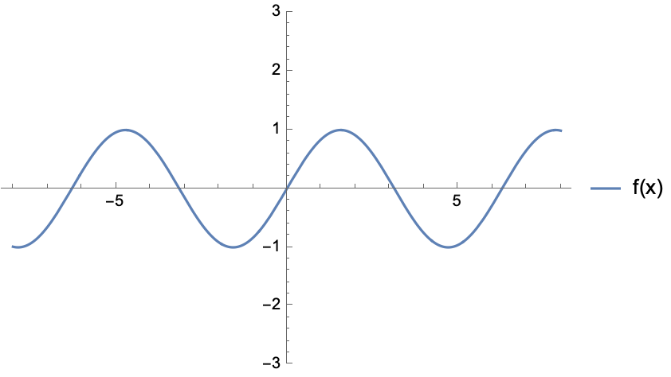
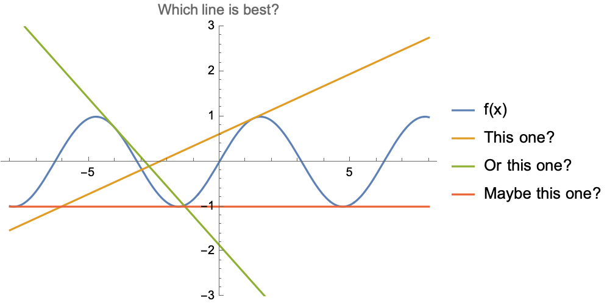

# State-space representation

For a general system, there may be multiple outputs that one may need information on, and also multiple inputs in which one can influence the system. For example, for a car, one may be interested in the position, heading, and velocity, and the car's motion can be influenced by throttle/braking and steering. We refer to a system with *multiple* inputs and *multiple* outputs as a **MIMO** system. As there are multiple inputs and multiple outputs, control design for MIMO systems is naturally more complex than *single* input *single* output (SISO) systems since MIMO systems need to handle complex interactions between multiple variables.[^1]

An efficient way to describe MIMO systems is via state-space representation, a mathematical framework for modeling a dynamical system using a set of *state variables* to track how inputs influence system behavior over time through first-order differential or difference equations.
The state variables are selected to capture the essential information about the system's current status, and with knowledge about the dynamics and external inputs (e.g., controls, disturbances), the future behavior or next state can be predicted.

## State-space definition

Given a system of interest, let $x\in\mathbb{R}^n$ be the *state vector* where $n$ denotes the smallest number of variables possible that can represent the entire state of the system at any given time. Let $u\in\mathbb{R}^m$ denote the *control vector* where $m$ denotes the number of control inputs.[^2]
Then, for a continuous time system, the future states can be predicted via a first-order differential equation,

$$
\dot{x}(t) = f(x(t), u(t), t) = \begin{bmatrix} f_1(x(t), u(t), t) \\ \vdots \\ f_n(x(t), u(t), t) \end{bmatrix}
$$

For mechanical systems, the first order differential equation typically describe the kinematics of dynamics of the system.

For the time being, let us assume the system is *fully observable*, meaning that we can measure every state variable. In practice, that is not usually the case and we can only measure some of the states, and we rely on a estimator (e.g., Kalman filter) to esimate the values of states that we cannot directly measure.

This general state space representation is particularly powerful for MIMO systems because it naturally handles multiple inputs and outputs, and it provides a framework for modern control design techniques such as state feedback, observers, and optimal control.

Note that the choice of state is somewhat vague. How does one go about defining a state?
Well, it depends on what exactly one is interested in modeling and the degree of detail one needs. For high-fidelity models, one may need many state variables to fully describe the system. While that may lead to a more accurate model, fully characterizing the dynamics may be difficult or expensive, and control synthesis for a high number of dimension may be computationally challenging. So there is a trade-off in model accuracy/fidelity and computational cost.

Additionally, the choice of state is not unique! This may be more apparent when considering [linear dynamical systems](#linear-state-space-model). One can consider a new state representation (same dimension) which is a transformation of a different one. The transformation may be motivated as a "math trick" to simplify the dynamics and its interpretation (e.g., choosing the eigenbasis). Fun fact: if you've ever seen discussion of vibrational "modes", those mode shapes and frequencies are found by a coordinate transformation of the state space representation.

## Control affine dynamics

The dynamics is control affine if it has the following form,

$$
\dot{x} = f_0(x,t) + B(x)u
$$
where only the control appears linearly, while the rest of the terms, referred to as the *drift* dynamics, is grouped together in the $f_0(x,t)$ term.
Given any general nonlinear dynamics, we can convert it into a control-affine system by augmenting the state with the controls, and treating $\dot{u}$ as the control instead.


## Linear state-space model

If the system is **linear**, then the dynamics take on a very specific form,

```{math}
:label: eq-linear-dynamics
\dot{x}(t) = A x(t) + B u(t)\\
y(t) = Cx(t) + Du(t)
```

Here:
- $x(t)$ is the state vector, representing the internal state of the system.
- $u(t)$ is the input vector, representing external control inputs to the system.
- $y(t)$ is the output vector, representing the system's outputs.
- $A$, $B$, $C$, and $D$ are matrices that define the system dynamics and input-output relationships.

The second equation describes how the measured output $y$ depends on the state $x$. For now, we can ignore it, or just assume that $y(t) = x(t)$.

Linear systems are nice because key system properties, like stability, controllability, observability, etc (things from AA/EE/ME 547) can be determined from knowing the $A, B, C$ and $D$ matrices.
Unfortunately, more often than not, our dynamics are not linear. What we can do instead is to **linearize** the system about a reference state and control, such as an equilibrium state and control, and consider linear dynamics *local* to the point of linearization.
Note that this linearization is only valid in a local region about the point of linearization. But, as it turns out, repeatedly linearizing and applying linear control techniques has proven to be extremely effective and widely used in practice.


### Linearization

Linearization of a dynamical system $\dot{x} = f(x,u)$ is the process of finding a linear dynamical system $\dot{x} = Ax + Bu$ that approximates the original system. For example, consider the following first-order dynamical system of a single scalar state variable:

$$
\dot{x} = \sin(x).
$$

This is plotted below, for a $x$ from $-8$ to $8$.



Suppose we want to find a line which approximates this function. We immediately see that any such approximation will only be valid *locally*, and there is no one line that gives the best approximation over the whole domain.



Thus we have to decide *at which point we want the linear approximation to be good*. Hence, when we linearize a system, we have to linearize it "about a point" which we choose. At this point, the "approximation" is exact; close to this point, it's pretty good; far away, it won't be very good at all. Once we've chosen that point, we find our approximation by taking a first-order Taylor series about that point.

Suppose we have a state and control $(x_0, u_0)$ that we wish to linearize nonlinear state-space dynamics $\dot{x} = f(x,u,t)$ about. Then we can apply a first-order Taylor expansion around $(x_0, u_0)$,

$$
\dot{x} = f(x,u,t) \approx f(x_0, u_0, t) + \nabla_xf(x_0, u_0,t)^T (x - x_0) +  \nabla_uf(x_0, u_0,t)^T (u - u_0) + \ldots
$$

where

$$
\nabla_xf(x, u,t)^T =
\begin{bmatrix}
\frac{\partial f_1}{\partial x_1} & \frac{\partial f_1}{\partial x_2} & \cdots & \frac{\partial f_1}{\partial x_n} \\
\frac{\partial f_2}{\partial x_1} & \frac{\partial f_2}{\partial x_2} & \cdots & \frac{\partial f_2}{\partial x_n} \\
\vdots & \vdots & \ddots & \vdots \\
\frac{\partial f_n}{\partial x_1} & \frac{\partial f_n}{\partial x_2} & \cdots & \frac{\partial f_n}{\partial x_n}
\end{bmatrix}
=
\begin{bmatrix}
\nabla_xf_1(x, u, t)^T \\ \vdots \\  \nabla_xf_n(x, u, t)^T
\end{bmatrix}
$$

$$
\nabla_uf(x, u,t)^T =
\begin{bmatrix}
\frac{\partial f_1}{\partial u_1} & \frac{\partial f_1}{\partial u_2} & \cdots & \frac{\partial f_1}{\partial u_m} \\
\frac{\partial f_2}{\partial u_1} & \frac{\partial f_2}{\partial u_2} & \cdots & \frac{\partial f_2}{\partial u_m} \\
\vdots & \vdots & \ddots & \vdots \\
\frac{\partial f_n}{\partial u_1} & \frac{\partial f_n}{\partial u_2} & \cdots & \frac{\partial f_n}{\partial u_m}
\end{bmatrix}
=
\begin{bmatrix}
\nabla_uf_1(x, u, t)^T \\ \vdots \\  \nabla_uf_n(x, u, t)^T
\end{bmatrix}
$$

The term $\nabla_xf(x, u,t)^T$ and $\nabla_uf(x, u,t)^T$ are the **Jacobians** of the dynamics with respect to the state and control respectively. Each row of the jacobian is the gradient vector for each element of the dynamics vector.

This first-order Taylor approximation actually results in *affine* dynamics of the form

$$ \dot{x} = Ax + Bu + C.$$

While this is not strictly linear, for optimization-based control (which we study later), practically speaking, it does not affect the way we solve the optimization problem.


#### Linearization about an equilibrium point

Suppose that we consider the *error state* $\delta x = x - x_0$ and *error controls* $\delta u = u - u_0$ about an equilibrium point $(x_0, u_0)$ where $f(x_0, u_0, t) = 0$. Then the *error dynamics* is

$$
\delta\dot{x} = \dot{x} - \dot{x}_0 = \dot{x} \approx \nabla_xf(x_0, u_0,t)^T \delta x +  \nabla_uf(x_0, u_0,t)^T \delta u
$$

which can be expressed as the linear dynamics

$$
\delta\dot{x} \approx A \delta x +  B \delta u
$$
where $A$ and $B$ are the Jacobian matrices with respect to state and control respectively.

## Time discretization

So far, we have been discussing *continuous-time* dynamics. We can analogously consider *discrete-time* dynamics, where instead of a first-order differential equation, we simply have a first-order *difference equation*.

$$ x_{t+1} = f_d(x_t, u_t,t)$$

where $t$ denotes a time step index, rather than a specific value of time.
Like the continuous-time case, we can also have linear discrete-time dynamics.

Discrete-time dynamics may be more desirable to work with, especially if we are taking an optimization-based approach to synthesizing a controller. By discretizing time, we can essentially optimize over a finite discrete sequence of state and controls, rather than optimizing over functions.
So how do we obtain discrete-time dynamics? We just integrate!

$$
\underbrace{x(t + \Delta t)}_{x_{k+1}} = \underbrace{x(t)}_{x_k} + \int_t^{t+\Delta t} f(x(\tau), u(\tau), \tau) d\tau
$$

Here, we used $k$ for the discrete time indexing to (hopefully) reduce confusion and avoid overloading $t$, but generally, the time indexing should be inferred from context.
Quickly, you may see a problem. Computing the integrals can be nasty! For some relatively simple systems, you may want to compute the integral analytically, but generally, you would just solve the integrals via numerical methods, such as Euler integration or Runge-Kutta integration which are computationally cheap. We can also leverage automatic differentiation tools to efficiently compute Jacobians to linearize the discrete-time dynamics.
(You will do this in homework 1.)


[^1]: If you took a course in feedback control where you first learned about transfer functions, root locus, Bode plots, etc, then you have worked with SISO systems.

[^2]: We can additionally consider disturbance inputs, but we omit this for the time being.
